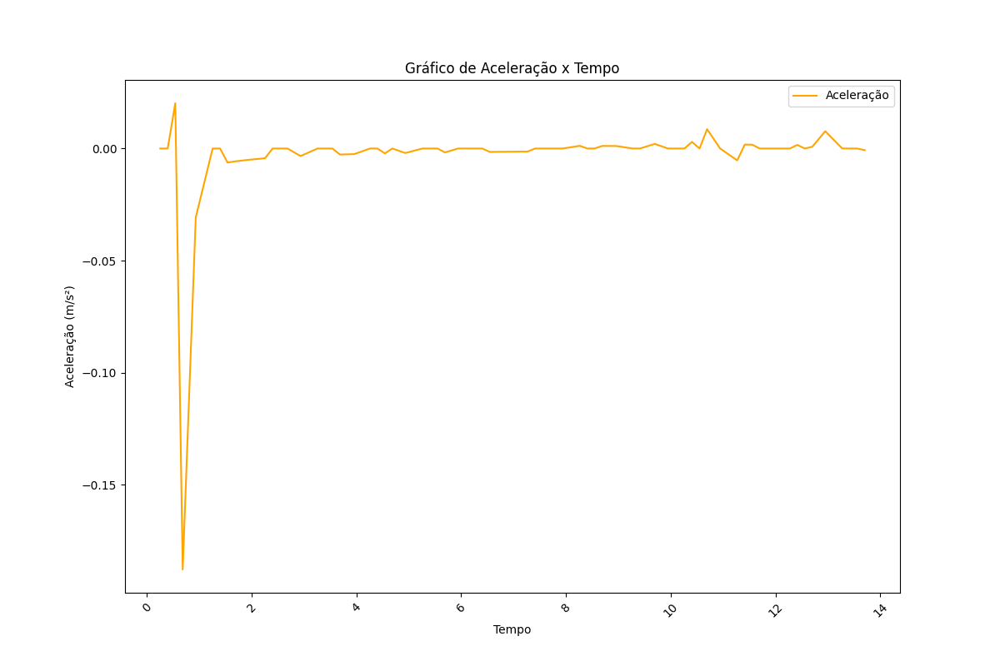

---
hide:
  - toc
---

# Controle de Trajetória de Foguetes D'água

## Consultar Voos
### Lançamento 1

    
    
    

#### Dados do Lançamento:
    - Pressão:  21.0 Pa
    - Volume d’água: 300.0 L
    - Massa do Foguete: 0.3 kg
    - Ângulo do Lançamento: 35.0°
    - Velocidade Média: 0.1814285714285714 kg
    - Aceleração Média: -0.0031066295982577602 kg

### Lançamento 2

    
    
    

#### Dados do Lançamento:
    - Pressão:  80.0 Pa
    - Volume d’água: 300.0 L
    - Massa do Foguete: 0.3 kg
    - Ângulo do Lançamento: 35.0°
    - Velocidade Média: 0.1814285714285714 kg
    - Aceleração Média: -0.0031066295982577602 kg

### Lançamento 3

    
    
    

#### Dados do Lançamento:
    - Pressão:  80.0 Pa
    - Volume d’água: 300.0 L
    - Massa do Foguete: 1.0 kg
    - Ângulo do Lançamento: 35.0°
    - Velocidade Média: 0.1814285714285714 kg
    - Aceleração Média: -0.0031066295982577602 kg

